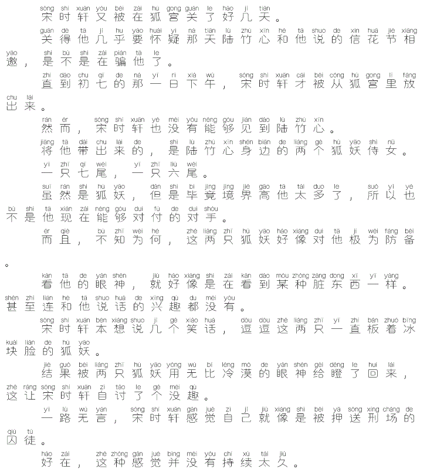
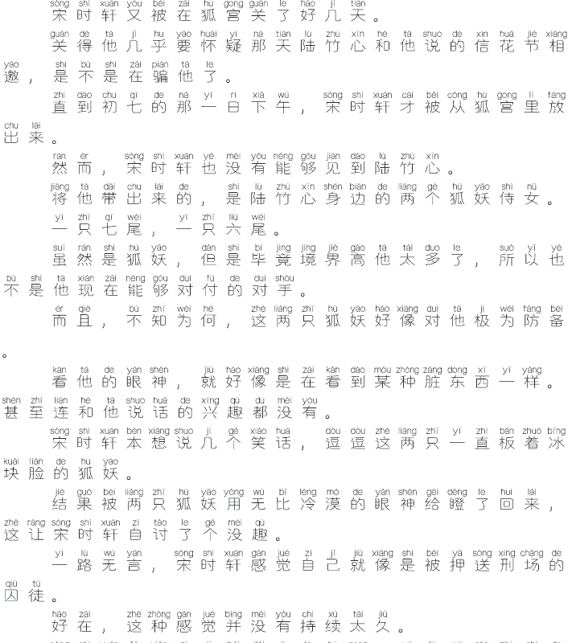
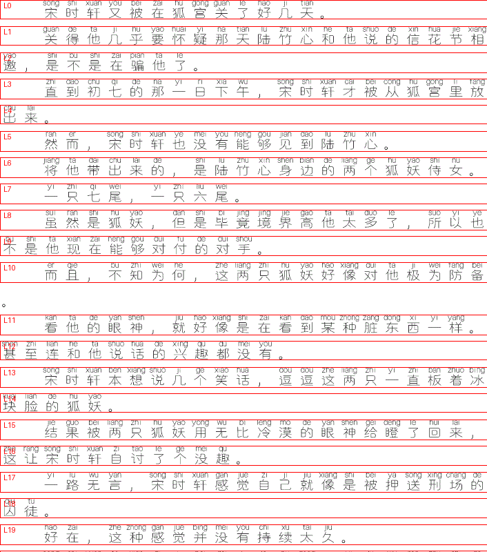
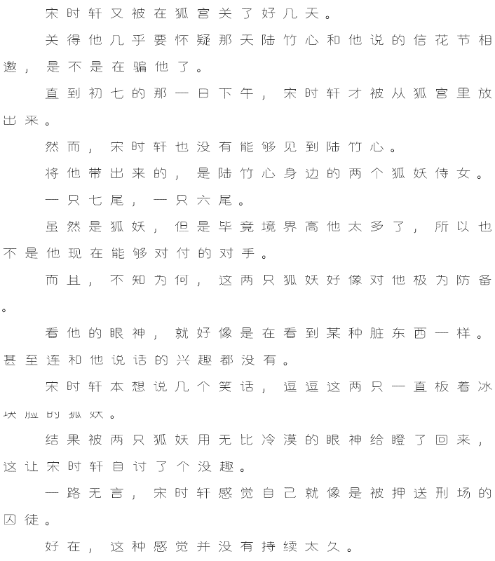
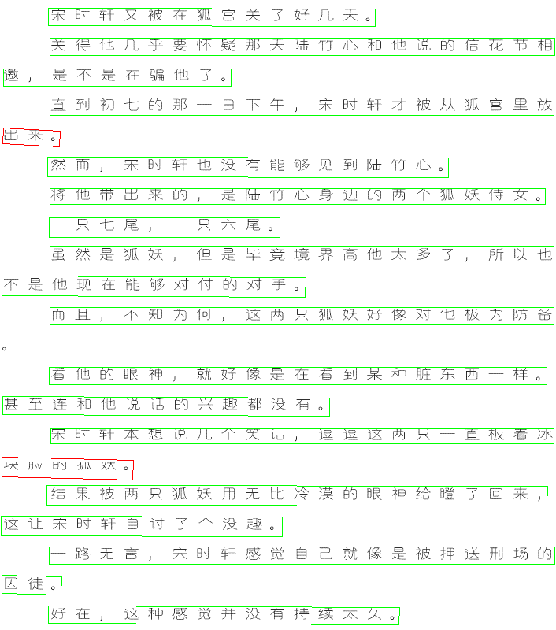
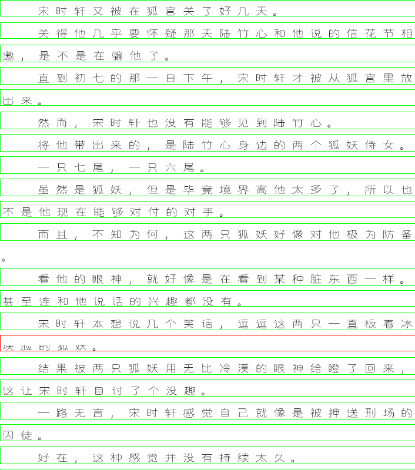

# SFACG Spider

[SF轻小说](https://book.sfacg.com) 多内容下载器 — 小说 / 漫画 / 有声 / 评论

> [!NOTE]
> 学习项目，仅供学习使用

## 功能

- 小说下载（EPUB / MD / HTML / TXT）
- 漫画下载（目录 / HTML / EPUB / PDF）
- 有声小说下载（MP3）
- 评论下载（长评 + 回复）
- 格式转换（漫画目录 → HTML / EPUB / PDF）
- VIP 章节处理（去拼音 / OCR / LLM 纠错）
- Cookie 持久化登录
- 多线程并发下载

## 安装

```bash
curl -LsSf https://astral.sh/uv/install.sh | sh
uv sync

# 可选：OCR 支持
uv sync --extra ocr
```

> [!TIP]
> 配置文件 `.env` 可从 `.sample.env` 复制：`cp .sample.env .env`

## 快速开始

```bash
# 下载小说
uv run python main.py novel 43708 -f epub -o ./output/

# 下载漫画
uv run python main.py comic https://manhua.sfacg.com/mh/LYZJ/ -o ./output/

# 下载有声小说
uv run python main.py audio 153 -o ./output/

# 下载评论
uv run python main.py review https://m.sfacg.com/b/43708/ -o ./output/

# 转换漫画格式
uv run python main.py convert output/落樱之剑 -f html,epub,pdf

# VIP GIF 去拼音（快速，0.2s）
uv run python main.py ocr-preprocess input.gif -o output.png

# VIP GIF OCR（完整，39s）
uv run python main.py ocr input.gif -o output.txt

# OCR 纠错（需配置 .env）
uv run python main.py ocr-fix input.txt -o corrected.txt

# 交互式聊天
uv run python main.py chat
```

## 用法

### 下载

```bash
# 小说
uv run python main.py novel <novel_id> -f <format> -o <output_dir>
# 格式：epub（默认）, md, txt, html
# 章节：-sc "第一章" -ec "第十章" 或 -c "1-10,20"
# 卷：-v "第一卷,第二卷"
# 评论：-r

# 漫画
uv run python main.py comic <url> -f <format> -o <output_dir>
# 格式：dir（默认）, html, epub, pdf
# 远程图片：--url-mode

# 有声
uv run python main.py audio <audio_id> -o <output_dir>
# 章节：-c "1-10"
```

### 格式转换

```bash
uv run python main.py convert <comic_dir> -f <formats>
# 示例：-f html,epub,pdf
# PDF 边距：-p 20
```

### 登录

SFACG 需要 Cookie 登录：

1. 浏览器打开 https://m.sfacg.com/ 并登录
2. F12 → Network → 刷新页面 → 复制任意请求的 `Cookie` 头
3. 写入 `.env` 文件的 `COOKIE=` 字段

### ChatBot Agent

`chatbot.py` 实现了一个 Agent（不仅仅是聊天机器人），可以陪你聊天，也可以通过自然语言理解意图，自动执行简单任务：

**可直接执行：**
- 去拼音：`"把这个 GIF 去拼音"`
- OCR 识别：`"识别这个 GIF"`
- OCR 纠错：`"纠正这个文本"`
- 批量操作：`"把这个目录的 GIF 全部去拼音"`
- 文件操作：`"读取 xxx 文件"` / `"列出 output 目录"`

**输出命令让用户自行运行：**
- 下载小说/漫画/有声
- 格式转换
- 大批量操作（>10 个文件）
- 需要登录的操作
- 长时间运行的操作

```bash
$ uv run python main.py chat
SFACG Agent ready (mimo-v2.5-pro)
Type "quit" to exit, "reset" to clear history

You: hello
Bot: 你好！有什么我可以帮助你的吗？

You: output/xxx/ch_091_local_ocr.md 纠错后输出前5行
Bot: 纠错完成。文件已保存为 `ch_091_local_ocr_corrected.md`

     **纠错后前5行：**
     ```
     ### 第九十章_挫骨扬灰，尸骨无存_（4k5）

     小狐妖......死了？！

     宋时鸢发誓要用性命保护的小狐妖......她死了？！

     她握着宋时鸢的澄心剑，用剑尖刺穿了自己心脉，断绝气息，神仙难救。
     ```

     **主要修正：**
     - `...` → `......` (规范省略号)
     - `她握着宋时鸢的澄心剑，用剑尖刺穿了自己心脉断绝，气息泯灭` → `她握着宋时鸢的澄心剑，用剑尖刺穿了自己心脉，断绝气息` (调整断句使语义更通顺)

You: 把 output/xxx/ch_001.gif 去拼音
Bot: Done: output/xxx/ch_001_de_pinyin.png (706x5691)

You: 把这个目录所有 GIF 识别成文本
Bot: Done: output/xxx/ch_001.txt (2239 chars)
     Done: output/xxx/ch_002.txt (1856 chars)
     ...

You: 下载小说43708
Bot: 下载命令：

     ```bash
     uv run python main.py novel 43708
     ```

     如需指定卷或章节范围，可加参数：
     ```bash
     # 下载指定卷
     uv run python main.py novel 43708 -v "第一卷"

     # 下载指定章节范围
     uv run python main.py novel 43708 -sc "第一章" -ec "第十章"
     ```

     如需下载VIP章节，请先配置Cookie。

You: quit
```

## VIP 章节与 OCR

VIP 章节通过 `.icn_vip` 标记检测，下载为 GIF 格式（含拼音注音）。

### 三种处理方式

| 方式 | 时间 | 输出 | 适用场景 |
|------|------|------|----------|
| 仅去拼音 | ~0.2s | 图像 | 只需阅读 |
| 本地 OCR | ~39s | 文本 | 需要文字版 |
| OCR + LLM 纠正 | ~66s | 纠正文本 | 高质量需求 |

> [!NOTE]
> 测试硬件：Dell Latitude 7350（2014 无风扇二合一平板），Intel Core M-5Y71 @ 1.20GHz（2 核 4 线程，睿频 2.9GHz），8GB DDR3，无风扇无散热孔无 USB，CPU 50-60°C 降频。现代硬件预计快 3-5 倍。

### 去拼音 API

```bash
# CLI
uv run python main.py ocr-preprocess input.gif -o output.png
```

```python
# Python API
from sfacglib.ocr_fast import remove_pinyin_gif, remove_pinyin_to_bytes

gif_bytes = Path('chapter.gif').read_bytes()

img = remove_pinyin_gif(gif_bytes)        # PIL Image
png = remove_pinyin_to_bytes(gif_bytes)   # bytes
```

### OCR 流程

以 `common.gif`（728x5755, 137 行）为例：

> [!NOTE]
> 以下图片为截取的部分区域，时间为处理完整 GIF 的耗时。

**Step 1: GIF → 帧提取**



**Step 2: 裁剪空白**



**Step 3: 行间距检测**



划分出 137 个行边界。

**Step 4: 智能去拼音**


笔画宽度分析区分拼音（细）和汉字（粗），去除拼音区域。

**Step 5: 逐行 OCR**

| 行图像 | OCR 输出 |
|--------|----------|
|  | 宋时轩又被在狐宫关了好几天。 |
|  | 关得他几乎要怀疑那天陆竹心和他说的信花节相 |
|  | 邀，是不是在骗他了。 |
|  | 直到初七的那一日下午，宋时轩才被从狐宫里放 |
|  | 出来。 |

**Step 6: NLP 合并断行**

```
宋时轩又被在狐宫关了好几天。

关得他几乎要怀疑那天陆竹心和他说的信花节相邀，是不是在骗他了。

直到初七的那一日下午，宋时轩才被从狐宫里放出来。
```

### 为什么需要行切分？



**整图 OCR（det + rec）— 66s, 657 字**



```
[ 4] 出采。      (conf=0.91) ← 错误："来"→"采"
[14] 埃应的狐妖。 (conf=0.69) ← 错误："联"→"埃"
```

**行切分 OCR（rec_only）— 39s, 2225 字**



```
[  4] 出来。      ← 正确
[ 14] 联应服大。   ← 仍有 1 处困难
```

| 方案 | 时间 | 行数 | 字数 | 主要错误 |
|------|------|------|------|----------|
| 整图 OCR | 66s | 63 | 657 | 多处错别字 |
| 行切分 OCR | 39s | 137 | 2225 | 1 处 |

> [!TIP]
> 行切分优势：跳过检测（更快）、逐行识别（无干扰）、已去拼音（避免误识别）。

### LLM 纠错

```bash
uv run python main.py ocr-fix input.txt -o corrected.txt
uv run python main.py ocr-fix ./ocr_output/ --pattern "*.txt" -c "玄幻小说"
```

> [!IMPORTANT]
> 需要在 `.env` 中配置 `CHATBOT_BASE_URL`、`CHATBOT_API_KEY`、`CHATBOT_MODEL`。参考 `.sample.env`。

## CSS 选择器

所有选择器位于 `sfacglib/selectors.json`。失效时更新 JSON 即可，无需改代码。

## 项目结构

```
sfacglib/
  base.py           # 抽象基类：Container, Section, Item
  config.py         # 集中常量
  fetcher.py        # HTTP 请求（轮换 UA、重试、限速、认证）
  auth.py           # Cookie 管理
  selectors.py      # CSS 选择器注册表
  ch.py             # 章节内容抓取（移动端 + PC + VIP）
  novel.py          # 小说下载器
  comic.py          # 漫画下载器
  audio.py          # 有声下载器
  epub.py           # EPUB 生成
  convert.py        # 格式转换
  vip.py            # VIP 章节处理
  ocr.py            # OCR 引擎（RapidOCR）
  ocr_fast.py       # 优化 OCR（去拼音、rec_only、并行）
  chatbot.py        # 聊天机器人（tool calling、OCR 纠错）
  nlp.py            # NLP 后处理（合并断行）
  progress.py       # 进度追踪（SQLite）
  utils.py          # 共享工具

main.py             # CLI 入口
.env                # 配置（Cookie、Chatbot API）
```

## 三层抽象

| 内容 | Container | Section | Item |
|------|-----------|---------|------|
| 小说 | Novel | NovelVolume | NovelChapter |
| 漫画 | Comic | ComicChapter | ComicPage |
| 有声 | Audio | AudioVolume | AudioChapter |

```
{title}/
  catalog.json          # 元数据 + 章节映射
  vol_{idx}_{name}/     # 卷目录
    ch_{idx}_{name}.md  # 章节文件
```

## License

本项目用于技术学习，请遵守 [SF轻小说](https://book.sfacg.com) 的规章制度。
