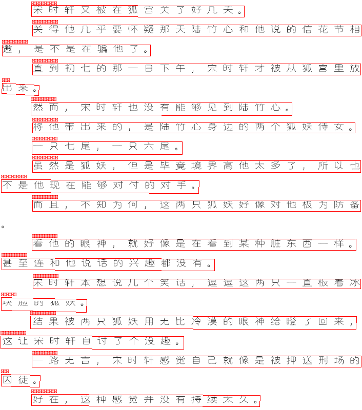
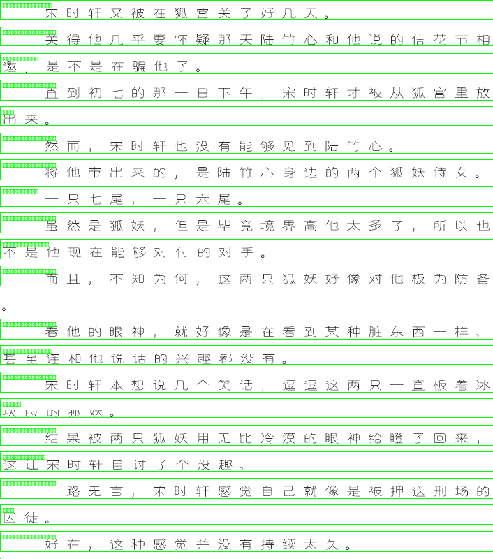
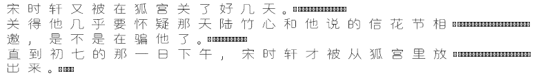

# SFACG Spider

[SF轻小说](https://book.sfacg.com) 多内容下载器 — 小说 / 漫画 / 有声 / 评论

> 学习项目，仅供学习使用

## 功能

- 小说下载（EPUB / MD / HTML / TXT）
- 漫画下载（目录 / HTML / EPUB / PDF）
- 有声小说下载（MP3）
- 评论下载（长评 + 回复）
- 格式转换（漫画目录 → HTML / EPUB / PDF）
- VIP 章节 OCR + LLM 纠错
- 多线程并发下载
- Cookie 持久化登录
- CSS 选择器集中管理

## 安装

```bash
curl -LsSf https://astral.sh/uv/install.sh | sh
uv sync

# 可选：OCR 支持
uv sync --extra ocr
```

## 快速开始

```bash
# 下载小说
uv run python main.py novel 43708 -f epub -o ./output/

# 下载小说带评论
uv run python main.py novel 43708 -f epub -r -o ./output/

# 下载漫画
uv run python main.py comic https://manhua.sfacg.com/mh/LYZJ/ -o ./output/

# 下载有声小说
uv run python main.py audio 153 -o ./output/

# 下载评论
uv run python main.py review https://m.sfacg.com/b/43708/ -o ./output/

# 转换漫画格式
uv run python main.py convert output/落樱之剑 -f html,epub,pdf

# OCR 图片
uv run python main.py ocr <image_url_or_path> -o output.txt

# 交互式聊天
uv run python main.py chat

# OCR 纠错
uv run python main.py ocr-fix input.txt -o corrected.txt
uv run python main.py ocr-fix ./ocr_output/ --pattern "*.txt" -c "玄幻小说"
```

## 详细用法

### 小说下载

```bash
uv run python main.py novel <novel_id> -f <format> -o <output_dir>

# 格式：epub（默认）, md, txt, html
# 章节范围：-sc "第一章" -ec "第十章" 或 -c "1-10,20,30-40"
# 卷过滤：-v "第一卷,第二卷"
# 评论：-r
```

### 漫画下载

```bash
uv run python main.py comic <url> -f <format> -o <output_dir>

# 格式：dir（默认）, html, epub, pdf
# HTML 远程图片：--url-mode
# 章节范围：-sc "第1话" -ec "第10话"
```

### 有声小说下载

```bash
uv run python main.py audio <audio_id> -o <output_dir>
# 章节范围：-c "1-10"
```

### 格式转换

```bash
uv run python main.py convert <comic_dir> -f <formats>
# 示例：-f html,epub,pdf
# PDF 边距：-p 20
```

## 登录

SFACG 登录需要验证码，不支持密码登录。从浏览器导入 Cookie：

1. 浏览器打开 https://m.sfacg.com/ 并登录
2. F12 → Network → 刷新页面 → 复制任意请求的 `Cookie` 头
3. 写入 `.env` 文件的 `COOKIE=` 字段

## 项目结构

```
sfacglib/
  base.py           # 抽象基类：Container, Section, Item
  config.py         # 集中常量
  fetcher.py        # HTTP 请求（轮换 UA、重试、限速、认证）
  auth.py           # Cookie 管理
  selectors.py      # CSS 选择器注册表
  ch.py             # 章节内容抓取（移动端 + PC + VIP）
  novel.py          # 小说下载器
  comic.py          # 漫画下载器
  audio.py          # 有声下载器
  epub.py           # EPUB 生成
  convert.py        # 格式转换
  vip.py            # VIP 章节处理
  ocr.py            # OCR 引擎（RapidOCR）
  ocr_fast.py       # 优化 OCR（去拼音、rec_only、并行）
  chatbot.py        # 聊天机器人（tool calling、OCR 纠错）
  nlp.py            # NLP 后处理（合并断行）
  progress.py       # 进度追踪（SQLite）
  utils.py          # 共享工具

main.py             # CLI 入口
.env                # 配置（Cookie、Chatbot API）
```

## 三层抽象

所有内容类型遵循 Container → Section → Item 层次：

| 内容 | Container | Section | Item |
|------|-----------|---------|------|
| 小说 | Novel | NovelVolume | NovelChapter |
| 漫画 | Comic | ComicChapter | ComicPage |
| 有声 | Audio | AudioVolume | AudioChapter |

下载产物目录结构：

```
{title}/
  catalog.json          # 元数据 + 章节映射
  vol_{idx}_{name}/     # 卷目录
    ch_{idx}_{name}.md  # 章节文件
```

## VIP 章节

VIP 章节通过 `.icn_vip` 标记检测，下载为 GIF 格式。

### OCR 流程（ocr_fast.py）

以 `common.gif`（728x5755, 137 行）为例，展示完整流程及中间产物：

**Step 1: GIF → 帧提取**


GIF 解码为 PIL Image 帧。本例为单帧长图。

**Step 2: 裁剪空白边距**


去除上下左右空白区域，减少无效计算。

**Step 3: 行间距检测 (find_line_gaps)**


分析灰度图像素行亮度，找到行与行之间的空白间隙，划分出 137 个行边界。

**Step 4: 智能去拼音 (_remove_pinyin_from_image)**


通过笔画宽度分析区分拼音（笔画细）和汉字（笔画粗），去除拼音区域，避免干扰识别。

**Step 5: 提取行图像 → RapidOCR 识别**

| 行图像 | OCR 输出 |
|--------|----------|
|  | 宋时轩又被在狐宫关了好几天。 |
|  | 关得他几乎要怀疑那天陆竹心和他说的信花节相 |
|  | 邀，是不是在骗他了。 |
|  | 直到初七的那一日下午，宋时轩才被从狐宫里放 |
|  | 出来。 |

每行图像独立识别（`rec_only` 模式，跳过检测），含拼音的行自动过滤。

**Step 6: NLP 合并断行 (merge_wrapped_lines)**

```
宋时轩又被在狐宫关了好几天。

关得他几乎要怀疑那天陆竹心和他说的信花节相邀，是不是在骗他了。

直到初七的那一日下午，宋时轩才被从狐宫里放出来。
```

将因图片宽度被截断的行重新合并为完整段落。

### OCR 方案对比

| 方案 | 时间 | 字数 | 准确率 | 依赖 |
|------|------|------|--------|------|
| 本地 OCR (ocr_fast) | ~39s | 2020 | 可读，少量错字 | 无（纯 CPU） |
| 本地 OCR + LLM 纠正 | ~66s | 2074 | 高（修正错别字和伪影） | LLM API |
| DeepSeek Web LLM | ~92s | 2153 | 近 100%（少量幻觉） | 浏览器 + 网络 |

**建议：** 日常用本地 OCR，高质量需求加 LLM 纠正。

### 为什么需要行切分？

去拼音后的图像作为输入，对比两种方案：


**方案 1：整图 OCR（det + rec）— 66s, 657 字**



检测器将多个短行合并、漏检长行，输出 63 行乱码：

```
所而*时舒也冷心化多又→H竹心
t  ,
K *
不是t班4付对T
且十知为付这为元夷大对像也数不际备
```

**方案 2：行切分 OCR（rec_only）— 39s, 2225 字**



每行独立识别，输出 137 行可读文本：

```
宋时轩又被在狐宫关了好几天。
关得他几乎要怀疑那天陆竹心和他说的信花节相邀，是不是在骗他了。
直到初七的那一日下午，宋时轩才被从狐宫里放出来。
```

**逐行识别细节：**



| 方案 | 时间 | 识别行数 | 字数 | 质量 |
|------|------|----------|------|------|
| 整图 OCR (det+rec) | 66s | 63 | 657 | 乱码严重 |
| 行切分 OCR (rec_only) | 39s | 137 | 2225 | 可读 |

行切分优势：
- 跳过检测步骤（`rec_only`），速度更快
- 每行独立识别，避免行间干扰
- 已去拼音，避免拼音被误识别为汉字

### LLM 纠错（可选）

```bash
# 单文件
uv run python main.py ocr-fix input.txt -o corrected.txt

# 批量目录
uv run python main.py ocr-fix ./ocr_output/ --pattern "*.txt" -c "玄幻小说，主角名：xxx"
```

`.env` 配置：

```env
CHATBOT_BASE_URL=https://your-api-endpoint/v1
CHATBOT_API_KEY=your-api-key
CHATBOT_MODEL=your-model-name
```

## CSS 选择器

所有选择器位于 `sfacglib/selectors.json`。失效时更新 JSON 即可，无需改代码。

## License

本项目用于技术学习，请遵守 [SF轻小说](https://book.sfacg.com) 的规章制度。
